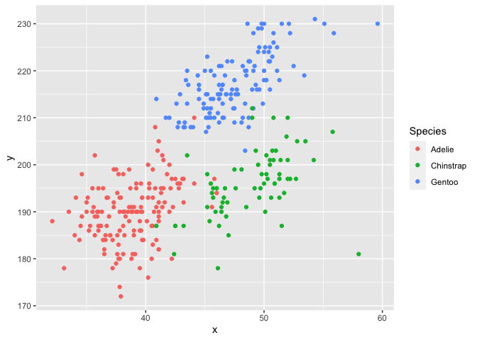

P8105 Homework 1
================

``` r
library(tidyverse)
```

    ## ── Attaching packages ─────────────────────────────────────── tidyverse 1.3.2 ──
    ## ✔ ggplot2 3.3.6     ✔ purrr   0.3.4
    ## ✔ tibble  3.1.8     ✔ dplyr   1.0.9
    ## ✔ tidyr   1.2.0     ✔ stringr 1.4.0
    ## ✔ readr   2.1.2     ✔ forcats 0.5.1
    ## ── Conflicts ────────────────────────────────────────── tidyverse_conflicts() ──
    ## ✖ dplyr::filter() masks stats::filter()
    ## ✖ dplyr::lag()    masks stats::lag()

# Problem 1

Firstly let’s load the `penguins` dataset ( after installing package
`palmerpenguins`).

``` r
data("penguins", package = "palmerpenguins")
```

Let’s check what are inside of the dataset:

``` r
penguins
```

    ## # A tibble: 344 × 8
    ##    species island    bill_length_mm bill_depth_mm flipper_…¹ body_…² sex    year
    ##    <fct>   <fct>              <dbl>         <dbl>      <int>   <int> <fct> <int>
    ##  1 Adelie  Torgersen           39.1          18.7        181    3750 male   2007
    ##  2 Adelie  Torgersen           39.5          17.4        186    3800 fema…  2007
    ##  3 Adelie  Torgersen           40.3          18          195    3250 fema…  2007
    ##  4 Adelie  Torgersen           NA            NA           NA      NA <NA>   2007
    ##  5 Adelie  Torgersen           36.7          19.3        193    3450 fema…  2007
    ##  6 Adelie  Torgersen           39.3          20.6        190    3650 male   2007
    ##  7 Adelie  Torgersen           38.9          17.8        181    3625 fema…  2007
    ##  8 Adelie  Torgersen           39.2          19.6        195    4675 male   2007
    ##  9 Adelie  Torgersen           34.1          18.1        193    3475 <NA>   2007
    ## 10 Adelie  Torgersen           42            20.2        190    4250 <NA>   2007
    ## # … with 334 more rows, and abbreviated variable names ¹​flipper_length_mm,
    ## #   ²​body_mass_g
    ## # ℹ Use `print(n = ...)` to see more rows

-   There are 8 variables, including **species**, **island**,
    **bill_length_mm**, **bill_depth_mm**, **flipper_length_mm**,
    **body_mass_g**, **sex**, **year**. *NA* denotes missing data.
    **species**, **island**, and **sex** are factor vectors, while the
    rest are numeric.

-   There are 344 rows and 8 columns in the dataset.

-   The mean flipper length is 200.92 mm.

This is going to make a plot! First I generate a dataframe, then use
`ggplot` to make a scatterplot.

``` r
plot_df =
  tibble(
    x = penguins$bill_length_mm,
    y = penguins$flipper_length_mm
  )

Species = penguins$species

ggplot(plot_df, aes(x = x, y = y, color = Species)) + geom_point()
```

<!-- -->

Export the scatterplot:

``` r
ggsave("scatter_plot.pdf", height = 4, width = 6)
```

# Problem 2

The chunk below creates a data frame comprised of:

-   a random sample of size 10 from a standard Normal distribution
-   a logical vector indicating whether elements of the sample are
    greater than 0
-   a character vector of length 10
-   a factor vector of length 10, with 3 different factor “levels”

``` r
p2_df = tibble(
  samp = rnorm(10),
  var_logic = samp > 0,
  var_char = c("a","b","c","b","a","b","c","b","a","b"),
  var_factor = factor(c("Mon","Fri","Sun","Fri","Mon","Fri","Sun","Mon","Fri","Sun"))
)
```

Then I will try to take the mean of each variable in my dataframe.

``` r
mean(pull(p2_df, samp))
```

    ## [1] -0.1493143

``` r
mean(pull(p2_df, var_logic))
```

    ## [1] 0.4

``` r
mean(pull(p2_df, var_char))
```

    ## Warning in mean.default(pull(p2_df, var_char)): argument is not numeric or
    ## logical: returning NA

    ## [1] NA

``` r
mean(pull(p2_df, var_factor))
```

    ## Warning in mean.default(pull(p2_df, var_factor)): argument is not numeric or
    ## logical: returning NA

    ## [1] NA

The means for the random sample and the logical vector worked, but the
charactor and the factor vectors did not.

This is going to write a code chunk that applies the `as.numeric`
function to the logical, character, and factor variables:

``` r
as.numeric(p2_df$var_logic)
as.numeric(p2_df$var_char)
as.numeric(p2_df$var_factor)
```

The logical and factor variables are successfully converted to numeric,
but for the charactor variable, it shows *NAs introduced by coercion*
and only NAs are shown in the output. Because the charactor variable in
this data frame created consists of letters rather than numbers. And for
the factor, it is converted to the level number.
